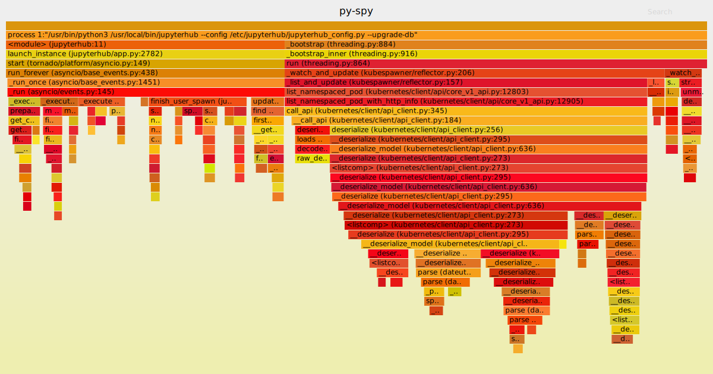

# Profiling
During stress testing, or even normal operations, [py-spy](https://github.com/benfred/py-spy) can be used to capture profiling data. It will generate SVGs
that show where the hub is spending its time.

1. [Installation](#py-spy-installation)
1. [Collecting data](#py-spy-collecting-data)
   1. [`py-spy top`](#py-spy-top)
   1. [`py-spy record`](#py-spy-record)
   1. [`py-spy dump`](#py-spy-dump)

<a name="py-spy-installation"></a>
### Installation
`py-spy` is installed by z2jh but it won't work without additional configuration. The hub image
must be modified to set the `SYS_PTRACE` capability on the `py-spy` binary. The following line
should be added after `py-spy` has been installed and before root privileges are dropped during
the image build.

```
RUN setcap cap_sys_ptrace+ep $(which py-spy)
```

Additionally the `securityContext` must be configured in the hub deployment. This is done
by setting `containerSecurityContext` in `values.yaml`.

```yaml
containerSecurityContext:
  allowPrivilegeEscalation: true
  capabilities:
    drop:
    - all
    add:
    - SYS_PTRACE
```

<a name="py-spy-collecting-data"></a>
### Collecting data
`py-spy` must be run from inside the hub container.

```bash
$ kubectl -n <namespace> exec -it <pod> -- bash
```

There are three ways to investigate the hub's activity.

<a name="py-spy-top"></a>
1. `py-spy top`  
This shows a live view of which functions are taking most time. It's similar to the
Linux `top` command.
	```
	jovyan@hub-69f94ddc84-g26qj:/$ py-spy top -p 1

	Collecting samples from '/usr/bin/python3 /usr/local/bin/jupyterhub --config /etc/jupyterhub/jupyterhub_config.py --upgrade-db' (python v3.6.9)
	Total Samples 1118
	GIL: 0.00%, Active: 0.00%, Threads: 1

	  %Own   %Total  OwnTime  TotalTime  Function (filename:line)
	  0.00%   0.00%   0.010s    0.010s   add_timeout (tornado/ioloop.py:580)
	  0.00%   0.00%   0.000s    0.010s   <module> (jupyterhub:11)
	  0.00%   0.00%   0.000s    0.010s   start (tornado/platform/asyncio.py:149)
	  0.00%   0.00%   0.000s    0.010s   _run_callback (tornado/ioloop.py:743)
	  0.00%   0.00%   0.000s    0.010s   _schedule_next (tornado/ioloop.py:916)
	  0.00%   0.00%   0.000s    0.010s   launch_instance (jupyterhub/app.py:2782)
	  0.00%   0.00%   0.000s    0.010s   run_forever (asyncio/base_events.py:438)
	  0.00%   0.00%   0.000s    0.010s   _run (tornado/ioloop.py:911)
	  0.00%   0.00%   0.000s    0.010s   _run_once (asyncio/base_events.py:1451)
	  0.00%   0.00%   0.000s    0.010s   _run (asyncio/events.py:145)
    ```
    The output can be sorted by each column as well.
<a name="py-spy-record"></a>
1. `py-spy record`  
The record command runs in the foreground collecting samples and when it's closed (either
by CTRL+C or when it reaches its configured duration) an SVG flamegraph is written to disk.
    ```
    jovyan@hub-69f94ddc84-g26qj:/$ py-spy record -o /tmp/py-spy-trace -p 1
    py-spy> Sampling process 100 times a second. Press Control-C to exit.

    ^C
    py-spy> Stopped sampling because Control-C pressed
    py-spy> Wrote flamegraph data to '/tmp/py-spy-trace'. Samples: 20541 Errors: 0
    ```
    That will produce an SVG like this:
    
<a name="py-spy-dump"></a>
1. `py-spy dump`  
The dump command will dump the state of all threads for the specified process. It can
optionally show the local variables for each frame. This is helpful for figuring out why
the hub process may appear stuck for example.

	```
	jovyan@hub-69f94ddc84-g26qj:/$ py-spy dump -p 1 --locals
	Process 1: /usr/bin/python3 /usr/local/bin/jupyterhub --config /etc/jupyterhub/jupyterhub_config.py --upgrade-db
	Python v3.6.9 (/usr/bin/python3.6)

	Thread 1 (idle): "MainThread"
		select (selectors.py:445)
			Arguments::
				self: <EpollSelector at 0x7f79ac4ab898>
				timeout: 0.998
			Locals::
				max_ev: 3
				ready: []
		_run_once (asyncio/base_events.py:1415)
			Arguments::
				self: <_UnixSelectorEventLoop at 0x7f79ac4ab7b8>
			Locals::
				sched_count: 45
				timeout: 0.9979082886129618
				when: 5094106.57817052
		run_forever (asyncio/base_events.py:438)
			Arguments::
				self: <_UnixSelectorEventLoop at 0x7f79ac4ab7b8>
			Locals::
				old_agen_hooks: (None, None)
		start (tornado/platform/asyncio.py:149)
			Arguments::
				self: <AsyncIOMainLoop at 0x7f79ac447be0>
			Locals::
				old_loop: <_UnixSelectorEventLoop at 0x7f79ac4ab7b8>
		launch_instance (jupyterhub/app.py:2782)
			Arguments::
				cls: <MetaHasTraits at 0x30ee728>
				argv: None
			Locals::
				self: <JupyterHub at 0x7f79b12b7358>
				loop: <AsyncIOMainLoop at 0x7f79ac447be0>
				task: <_asyncio.Task at 0x7f79abd788c8>
		<module> (jupyterhub:11)
	```
