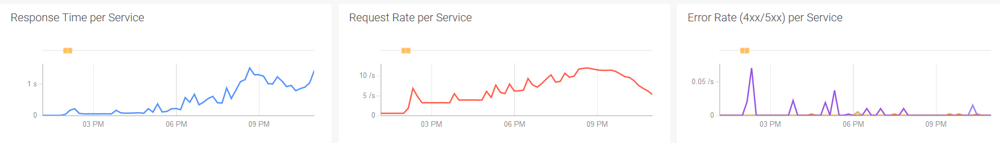
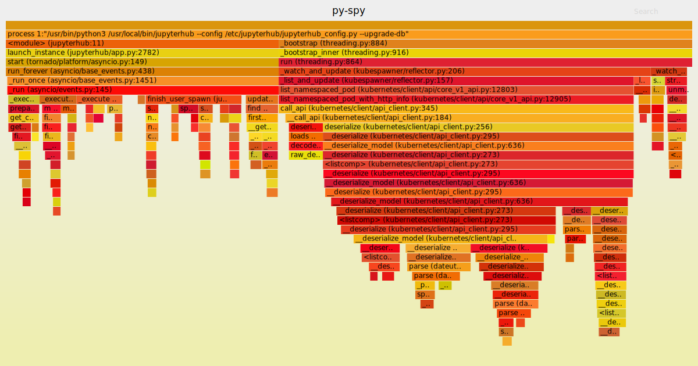

# Hub Stress Testing

This document gives an overview of the [hub-stress-test script](../scripts/hub-stress-test.py)
and how it can be used.

1. [Setup](#setup)
1. [Scaling up](#scaling-up)
   1. [Placeholders and user nodes](#placeholders)
   1. [Steady state testing](#steady-state)
1. [Scaling down](#scaling-down)
1. [Monitoring](#monitoring)
1. [Profiling](#profiling)
   1. [Installation](#py-spy-installation)
   1. [Collecting data](#py-spy-collecting-data)
	  1. [`py-spy top`](#py-spy-top)
	  1. [`py-spy record`](#py-spy-record)
	  1. [`py-spy dump`](#py-spy-dump)

<a name="setup"></a>
## Setup

You will need two things to run the script, an admin token and a target hub API endpoint URL.

The admin token can be provided to the script on the command line but it's recommended to create a
file from which you can source and export the `JUPYTERHUB_API_TOKEN` environment variable.

For the hub API endpoint URL, you can probably use the same value as the `JUPYTERHUB_API_URL`
environment variable in your user notebooks, e.g. `https://myhub-testing.acme.com/hub/api`.

Putting these together, you can have a script like the following to prepare your environment:

```bash
#!/bin/bash -e
export JUPYTERHUB_API_TOKEN=abcdef123456
export JUPYTERHUB_ENDPOINT=https://myhub-testing.acme.com/hub/api
```

<a name="scaling-up"></a>
## Scaling up

By default the `hub-stress-test` script will scale up to 100 users and notebook servers (pods)
in batches, wait for them to be "ready" and then stop and delete them.

<a name="placeholders"></a>
### Placeholders and user nodes

The number of pods that can be created in any given run depends on the number of
`user-placeholder` pods already in the cluster and the number of `user` nodes. The
`user-placeholder` pods are pre-emptible pods which are part of a StatefulSet:

```console
$ kubectl get statefulset/user-placeholder -n jhub
NAME               READY     AGE
user-placeholder   300/300   118d
```

We normally have very few of these in our testing cluster but need to
scale them up when doing stress testing otherwise the `hub-stress-test` script has to wait
for the auto-scaler to add more nodes to the `user` worker pool. The number of available
workers can be found like so:

```console
$ kubectl get nodes -l workerPurpose=users | grep -c "Ready\s"
13
```

The number of `user` nodes needed for a scale test will depend on the resource requirements
of the user notebook pods, reserved space on the nodes, other system pods running on the nodes,
e.g. logging daemon, pod limits per node, etc.

If there are not enough nodes available and the auto-scaler has to create them
as the stress test is running, we can hit the [consecutive failure limit](https://github.com/jupyterhub/zero-to-jupyterhub-k8s/blob/363d0b7db5/jupyterhub/values.yaml#L17) which will cause the hub container to crash and restart.
One way to avoid this is run the script with a `--count` that is not higher than 500 which
gives time between runs for the auto-scaler to add more `user` nodes.

As an example, the `kubelet` default `maxPods` limit is 110 per node and on IBM Cloud there are about
25 system pods per node. Our testing cluster user notebooks are using a micro
profile so their resource usage is not an issue, they are just limited to the 110 pod-per-node limit.
As a reference, to scale up to 3000 users/pods we need to have at least 35 user nodes.

<a name="steady-state"></a>
### Steady state testing

The `--keep` option can be used to scale up the number of pods in the cluser and retain them
so that you can perform tests or profiling on the hub with a high load. When the script runs
it will first check for the number of existing `hub-stress-test` users and start creating new
users based on an index so you can run the script with a `--count` value of 200-500 if you need
to let the auto-scaler add `user` nodes after each run.

Note that the `c.NotebookApp.shutdown_no_activity_timeout` value in the user notebook image (in the
testing cluster) should either be left at the default (0) or set to some larger window so that while
you are scaling up the notebook pods do not shut themselves down.

<a name="scaling-down"></a>
## Scaling down

If you used the `--keep` option to scale up and retain pods for steady state testing, when you are
done you can scale down the pods and users by using the `--purge` option. The users created by the
script all have a specific naming convention so it knows which notebook servers to stop and users
to remove.

<a name="monitoring"></a>
## Monitoring

Depending on the number of pods being created or deleted the script can take awhile. During a run
there are some dashboards you should be watching and also the hub logs. The logging and monitoring
platform is deployment-specific but the following are some examples of dashboards we monitor:

* `Jupyter Notebook Health (Testing)`
  This dashboard shows the active user notebook pods, nodes in the cluster and `user-placeholder`
  pods. This is mostly interesting to watch the active user notebook pods go up or down when scaling
  up or down with the script. The placeholders and user nodes may also fluctuate as placeholder pods
  are pre-empted and as the auto-scaler is adding or removing user nodes.

  

* `Jupyter Hub Golden Signals (testing)`
  This is where you can monitor the response time and request rate on the hub. As user notebook pods
  are scaled up each of those pods will "check in" with the hub to report their activity. By default
  each pod checks in with the hub every [5 minutes](https://github.com/jupyterhub/jupyterhub/blob/5dee864af/jupyterhub/singleuser.py#L463). So we expect that the more active user notebook pods in the cluster will increase
  the request rate and increase the response time in this dashboard. The error rates may also increase
  as we get 429 responses from the hub while scaling up due to the [concurrentSpawnLimit](https://github.com/jupyterhub/zero-to-jupyterhub-k8s/blob/363d0b7db/jupyterhub/values.yaml#L16). Those 429 responses are expected
  and the `hub-stress-test` script is built to retry on them. Here is an example of a 3000 user load
  run:

  

  That run started around 2:30 and then the purge started around 9 which is why response times track
  the increase in request rates. As the purge runs the number of pods reporting activity is going down
  so the request rate also goes down. One thing to note on the purge is that the [slow_stop_timeout](https://github.com/jupyterhub/jupyterhub/blob/42adb4415/jupyterhub/handlers/base.py#L761) defaults to 10 seconds so as
  we are stopping user notebook servers (deleting pods) the response times spike up because of that
  arbitrary 10 second delay in the hub API.

  Other useful panels on this dashboard are for tracking CPU and memory usage of the hub. From the same
  3000 user run as above:

  

  CPU, memory and network I/O increase as the number of user notebook pods increases and are reporting
  activity to the hub. The decrease in CPU and network I/O are when the purge starts running. Note that
  memory usage remains high even after the purge starts because the hub aggressively caches DB state in
  memory and is apparently not cleaning up the cache references even after spawners and users are deleted
  from the database.

<a name="profiling"></a>
## Profiling

During stress testing, or even normal operations, [py-spy](https://github.com/benfred/py-spy) can be used to capture profiling data. It will generate SVGs
that show where the hub is spending its time.

<a name="py-spy-installation"></a>
### Installation
`py-spy` is installed by z2jh but it won't work without additional configuration. The hub image
must be modified to set the `SYS_PTRACE` capability on the `py-spy` binary. The following line
should be added after `py-spy` has been installed and before root privileges are dropped during
the image build.

```
RUN setcap cap_sys_ptrace+ep $(which py-spy)
```

Additionally the `securityContext` must be configured in the hub deployment. This is done
by setting `containerSecurityContext` in `values.yaml`.

```yaml
containerSecurityContext:
  allowPrivilegeEscalation: true
  capabilities:
    drop:
    - all
    add:
    - SYS_PTRACE
```

<a name="py-spy-collecting-data"></a>
### Collecting data
`py-spy` must be run from inside the hub container.

```bash
$ kubectl -n <namespace> exec -it <pod> -- bash
```

There are three ways to investigate the hub's activity.

<a name="py-spy-top"></a>
1. `py-spy top`  
This shows a live view of which functions are taking most time. It's similar to the
Linux `top` command.
	```
	jovyan@hub-69f94ddc84-g26qj:/$ py-spy top -p 1

	Collecting samples from '/usr/bin/python3 /usr/local/bin/jupyterhub --config /etc/jupyterhub/jupyterhub_config.py --upgrade-db' (python v3.6.9)
	Total Samples 1118
	GIL: 0.00%, Active: 0.00%, Threads: 1

	  %Own   %Total  OwnTime  TotalTime  Function (filename:line)
	  0.00%   0.00%   0.010s    0.010s   add_timeout (tornado/ioloop.py:580)
	  0.00%   0.00%   0.000s    0.010s   <module> (jupyterhub:11)
	  0.00%   0.00%   0.000s    0.010s   start (tornado/platform/asyncio.py:149)
	  0.00%   0.00%   0.000s    0.010s   _run_callback (tornado/ioloop.py:743)
	  0.00%   0.00%   0.000s    0.010s   _schedule_next (tornado/ioloop.py:916)
	  0.00%   0.00%   0.000s    0.010s   launch_instance (jupyterhub/app.py:2782)
	  0.00%   0.00%   0.000s    0.010s   run_forever (asyncio/base_events.py:438)
	  0.00%   0.00%   0.000s    0.010s   _run (tornado/ioloop.py:911)
	  0.00%   0.00%   0.000s    0.010s   _run_once (asyncio/base_events.py:1451)
	  0.00%   0.00%   0.000s    0.010s   _run (asyncio/events.py:145)
    ```
    The output can be sorted by each column as well.
<a name="py-spy-record"></a>
1. `py-spy record`  
The record command runs in the foreground collecting samples and when it's closed (either
by CTRL+C or when it reaches its configured duration) an SVG flamegraph is written to disk.
    ```
    jovyan@hub-69f94ddc84-g26qj:/$ py-spy record -o /tmp/py-spy-trace -p 1
    py-spy> Sampling process 100 times a second. Press Control-C to exit.

    ^C
    py-spy> Stopped sampling because Control-C pressed
    py-spy> Wrote flamegraph data to '/tmp/py-spy-trace'. Samples: 20541 Errors: 0
    ```
    That will produce an SVG like this:
    
<a name="py-spy-dump"></a>
1. `py-spy dump`  
The dump command will dump the state of all threads for the specified process. It can
optionally show the local variables for each frame. This is helpful for figuring out why
the hub process may appear stuck for example.

	```
	jovyan@hub-69f94ddc84-g26qj:/$ py-spy dump -p 1 --locals
	Process 1: /usr/bin/python3 /usr/local/bin/jupyterhub --config /etc/jupyterhub/jupyterhub_config.py --upgrade-db
	Python v3.6.9 (/usr/bin/python3.6)

	Thread 1 (idle): "MainThread"
		select (selectors.py:445)
			Arguments::
				self: <EpollSelector at 0x7f79ac4ab898>
				timeout: 0.998
			Locals::
				max_ev: 3
				ready: []
		_run_once (asyncio/base_events.py:1415)
			Arguments::
				self: <_UnixSelectorEventLoop at 0x7f79ac4ab7b8>
			Locals::
				sched_count: 45
				timeout: 0.9979082886129618
				when: 5094106.57817052
		run_forever (asyncio/base_events.py:438)
			Arguments::
				self: <_UnixSelectorEventLoop at 0x7f79ac4ab7b8>
			Locals::
				old_agen_hooks: (None, None)
		start (tornado/platform/asyncio.py:149)
			Arguments::
				self: <AsyncIOMainLoop at 0x7f79ac447be0>
			Locals::
				old_loop: <_UnixSelectorEventLoop at 0x7f79ac4ab7b8>
		launch_instance (jupyterhub/app.py:2782)
			Arguments::
				cls: <MetaHasTraits at 0x30ee728>
				argv: None
			Locals::
				self: <JupyterHub at 0x7f79b12b7358>
				loop: <AsyncIOMainLoop at 0x7f79ac447be0>
				task: <_asyncio.Task at 0x7f79abd788c8>
		<module> (jupyterhub:11)
	```
